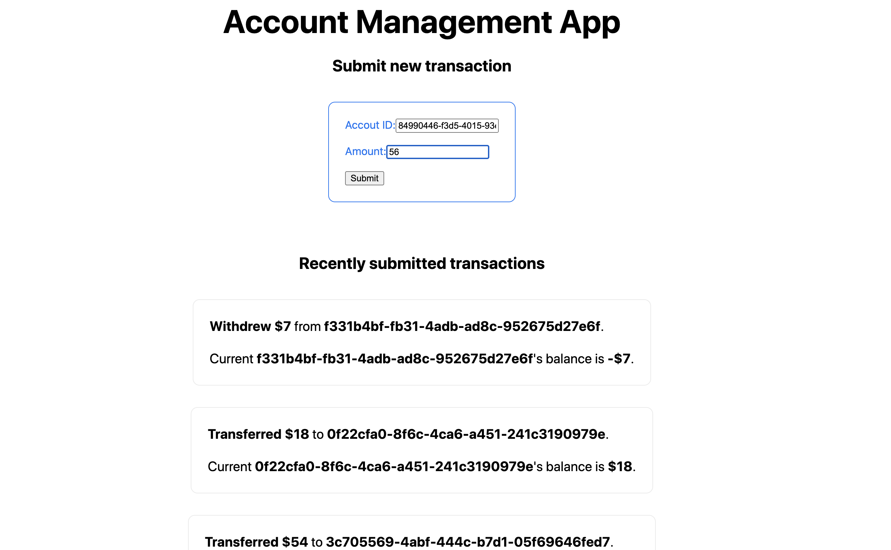

# Account Management Fullstack - Level 1

### The task 🧩

Your task is to build a Fullstack app that integrates and implements the [Account Management API](api-specification.yml). The API defines a set of operations for creating and reading account transactions. You can use [editor.swagger.io](https://editor.swagger.io/) to visualize the spec.

#### Frontend mockup 🧱

#### Frontend specification 📘
* There's a form with two input fields: Account ID and Amount. Whenever the form is submitted, a new transaction with the collected data should be created on the backend, and the corresponding input fields are cleared. The HTML elements must have the following HTML attributes:
  * Account ID input field: `data-type="account-id"`
  * Amount input field: `data-type="amount"`
  * Form: `data-type="transaction-form"`
* There's a list of the previously submitted transactions. Every newly submitted transaction should appear at the top of the list. The HTML element that represents a transaction should include the following HTML attributes: `data-type=transaction`, `data-account-id={transaction-account-id}`, `data-amount={transaction-amount}`, and `data-balance={current-account-balance}`

### What we expect from you ⏳

- **Commit your code to a new branch called `implementation`**.
- **Make the provided API tests pass**. We added a set of API and Frontend tests that run every time you push to a remote branch other than master/main. See the instructions below covering how to run them locally.
- **Document your decisions**. Extend this README.md with info about how to run your application along with any hints that will help us review your submission and better understand the decisions you made.

#### Backend
- **Use a SQLite database as the service datastore.** We want to see how you design your database schema and SQL queries for working with the service data. We suggest using [SQLite](https://www.sqlite.org/index.html) as it doesn't require running a DB server, which simplifies running the tests in the pipeline.
- **Optimize the GET endpoints for speed.** When designing your service, ensure that the GET endpoints remain fast with the database growing in size.
- **Organize your code as a set of low-coupled modules**. Avoid duplication and extract re-usable modules where it makes sense, but don't break things apart needlessly. We want to see that you can create a codebase that is easy to maintain.

#### Frontend
- **Integrate with a REST API**. Using the provided API spec, figure out the right service endpoints to use.
- **Implement client-side form data validation**. The API has restrictions on the allowed data format. Make sure to do the required checks client-side before sending the data to the server.
- **Organize your code with components**. Extract components that help you avoid duplication, but don't break things apart needlessly. We want to see that you can implement the UI with sound HTML semantics.

### Before you get started ⚠️

Configure your repository. You have 2 options:

1. [Import boilerplate](https://docs.devskills.co/collections/85-the-interview-process/articles/342-importing-challenge-boilerplate).
2. Alternatively, use the manual setup:
    1. Update the `apiUrl`(where your app will run) in [cypress.json](cypress.json).
    2. Update the [`build`](package.json#L5) and [`start`](package.json#L6) scripts in [package.json](package.json) to respectively build and start your app. **[See examples](https://www.notion.so/devskills/Fullstack-991deeab9622416389fd2fd9fb41da85)**.

### Running the API tests locally ⚙️

* Run `npm install`.
* Run your app.
* Run the tests with `npm run test`.

### When you're done ✅

1. Create a Pull Request from the `implementation` branch.
2. Answer the questions you get on your Pull Request.

**If you don't have enough time to finish**, push what you got and describe how you'd do the rest in a `.md` file.

### Need help? 🤯

Start with [Troubleshooting](https://www.notion.so/Troubleshooting-d18bdb5d2ac341bb82b21f0ba8fb9546), and in case it didn't help, create a new GitHub issue. A human will help you.

### Time estimate ⏳

About **4 hours**.

---

Made by [DevSkills](https://devskills.co).

How was your experience? **Give us a shout on [Twitter](https://twitter.com/DevSkillsHQ) / [LinkedIn](https://www.linkedin.com/company/devskills)**.

###Documentation

### Back End
** Api (located in Api directory ) **
1. App.py contains all the Routes for the services. App initilizer is also located there.
2. database.py contains the code for connection and creating schema 
3. controller/Transaction.py responsible for all the methods that interact with database and routes like controller  in MVC pattern.
4. Run 'python app.py' or 'flask run' to start the Api
5. UUID version 4 allowed only 
### Front End
** Located in  root directory **
1. App.js contains the front page, all the libraries and files required for the application
2. Only route located in App.js (Didn't make structure for route because of time limitation)
3. TransactionList.jsx contains the iterations of the transactions.

